# VarClustering Shiny Application Guide

A comprehensive guide to the interactive Shiny application for variable clustering.

---

## Table of Contents

1. [Launching the Application](#launching-the-application)
2. [Application Overview](#application-overview)
3. [User Workflow](#user-workflow)
   - [Step 1: Import Data](#step-1-import-data)
   - [Step 2: Configure Variables](#step-2-configure-variables)
   - [Step 3: Set Clustering Parameters](#step-3-set-clustering-parameters)
   - [Step 4: Run Clustering](#step-4-run-clustering)
   - [Step 5: Analyze Results](#step-5-analyze-results)
4. [Available Algorithms](#available-algorithms)
5. [Output Tabs](#output-tabs)
6. [Troubleshooting](#troubleshooting)

---

## Launching the Application

### From R Console

```r
# Load the package
library(VarClustering)

# Launch the Shiny application
varclust_gui()
```

### Required Dependencies

The application requires these packages (automatically checked at launch):

- `shiny` - Web framework
- `DT` - Interactive tables
- `readxl` - Excel file import

If any package is missing, the app will display an error with installation instructions.

---

## Application Overview

The VarClustering Shiny application provides an interactive interface for performing variable clustering analysis without writing code. It supports both **Hierarchical Variable Clustering (HClustVar and ModClust)** and **K-means Variable Clustering**.

### Interface Layout

The application consists of two main areas:

| Area | Description |
|------|-------------|
| **Sidebar (Left)** | Data import, variable configuration, clustering parameters |
| **Main Panel (Right)** | Dynamic tabs with visualizations and results |

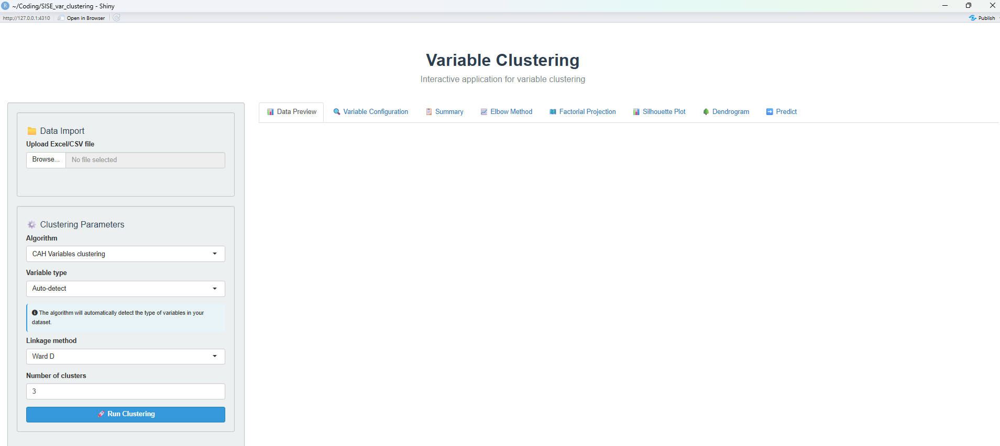

---

## User Workflow

### Step 1: Import Data

The application accepts **CSV** and **Excel** files (.xlsx, .xls).

#### Import Options

| Option | Description |
|--------|-------------|
| **First row as column names** | Check if your file has a header row |
| **Excel sheet number** | For Excel files with multiple sheets |

#### Supported Data Types

- **Quantitative variables**: Numeric columns
- **Qualitative variables**: Factor/character columns
- **Mixed**: Combination of both types

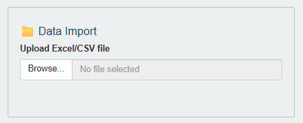

#### After Import

Once your file is uploaded:
1. The **Data Preview** tab shows your imported data
2. The **Configure Variables** button becomes active
3. Data summary displays number of observations and variables

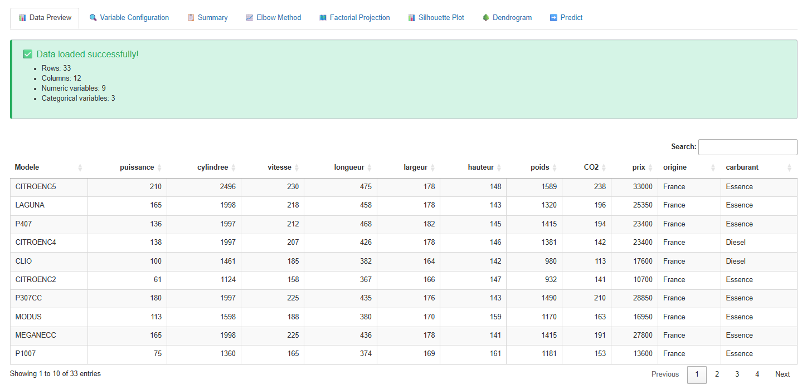

---

### Step 2: Configure Variables

Click **"⚙️ Configure Variables"** to open the configuration modal.

#### Variable Roles

| Role | Description | Usage |
|------|-------------|-------|
| **Active** | Used in clustering analysis | Core variables for clustering |
| **Illustrative** | For interpretation only | Predicted to clusters after fitting |
| **Excluded** | Completely ignored | ID columns, irrelevant variables |

<!-- 📸 SCREENSHOT: Variable configuration modal -->
<!-- Place screenshot here: screenshots/variable_config_modal.png -->
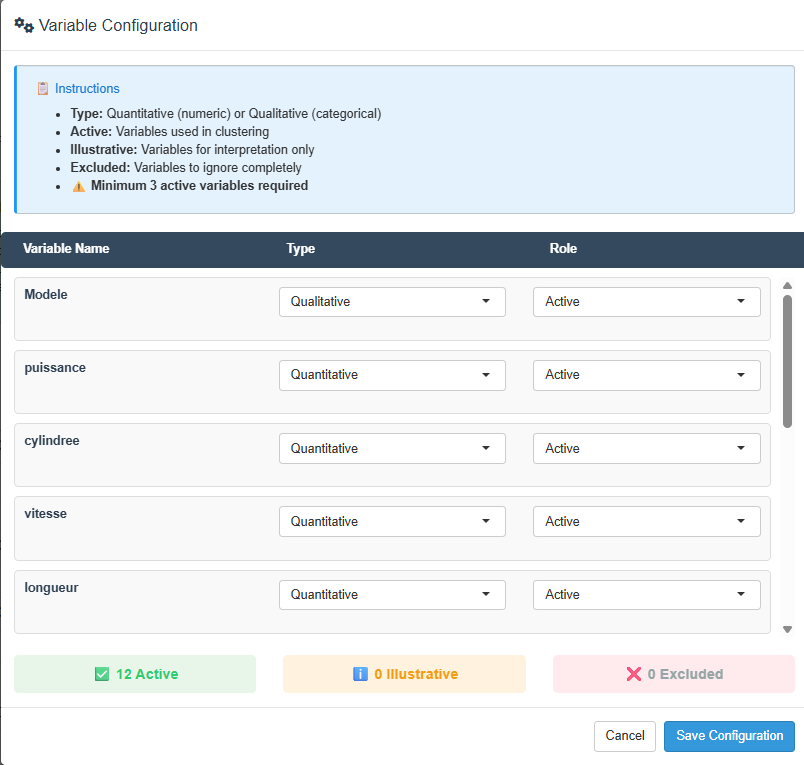

#### Configuration Summary

After configuration, the **Variable Configuration** tab displays:
- ✅ Active variables (green panel)
- ℹ️ Illustrative variables (orange panel)
- ❌ Excluded variables (red panel)

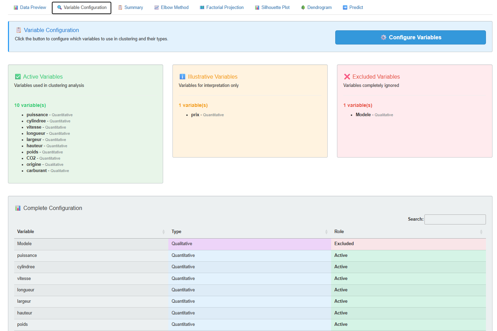

---

### Step 3: Set Clustering Parameters

Configure the clustering algorithm and its parameters.

#### Algorithm Selection

| Algorithm | Data Type | Description |
|-----------|-----------|-------------|
| **CAH Variables clustering** | Quant / Qual / Mixed | Hierarchical clustering of variables with dendrogram |
| **K-means Variables clustering** | Quantitative only | Iterative reallocation with PCA centroids |
| **CAH Modalities clustering** | Qualitative only | Hierarchical clustering of categories using Dice distance |


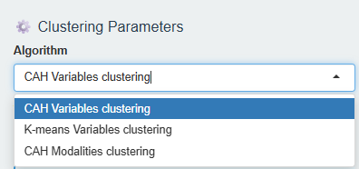

#### HClustVar Parameters

| Parameter | Options | Description |
|-----------|---------|-------------|
| **Variable type** | Auto-detect, Quantitative, Qualitative, Mixed | Type of variables to cluster |
| **Distance metric** | R², r | For quantitative variables |
| **Clustering method** | Ward D, Ward D2, Complete, Average, Single, etc. | Linkage method for CAH |
| **Number of clusters** | 2-10 | Target number of clusters |


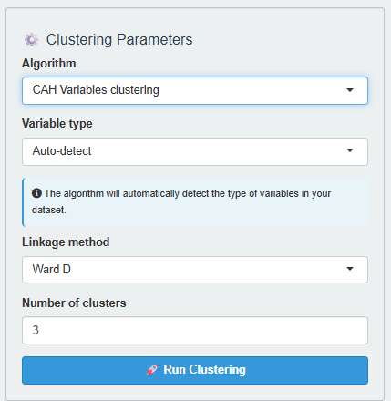

#### K-means Parameters

| Parameter | Default | Description |
|-----------|---------|-------------|
| **Distance metric** | R² | Correlation-based distance |
| **Max iterations** | 100 | Maximum iterations per run |
| **n_init (restarts)** | 3 | Number of random initializations |
| **Random seed** | 0 (random) | For reproducibility |
| **Number of clusters** | 3 | Target K value |


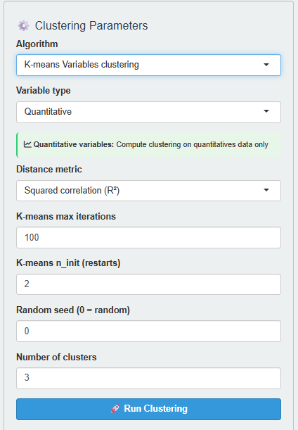

#### ModCluster Parameters (Modality Clustering)

| Parameter | Options | Description |
|-----------|---------|-------------|
| **Variable type** | Qualitative | Categories to cluster (fixed) |
| **Linkage method** | Complete, Average, Single | Agglomeration method for CAH |
| **Number of clusters** | 2-10 | Target number of modality groups |


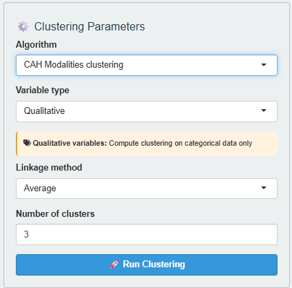

---

### Step 4: Run Clustering

Click **"🚀 Run Clustering"** to execute the analysis.

The application will:
1. Extract active variables from your data
2. Fit the selected clustering model
3. Generate all visualizations and summaries
4. Predict clusters for illustrative variables (if configured)


---

### Step 5: Analyze Results

After clustering completes, multiple tabs become available with results.

#### Summary Tab

The **Summary** tab provides comprehensive clustering results:

##### Quality Metrics

| Metric | Description | Interpretation |
|--------|-------------|----------------|
| **Average Silhouette** | Clustering quality score | > 0.5 is good, > 0.7 is excellent |
| **Total Variance Explained** | Proportion of variance captured | Higher is better |


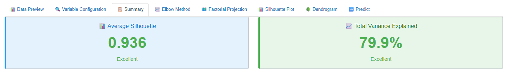

##### Cluster Summary Table

Shows for each cluster:
- Number of members
- Variation explained
- Proportion explained

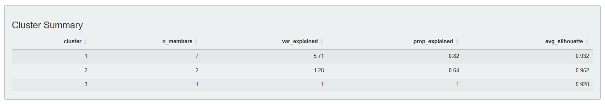

##### Variable Assignments Table

Details for each variable:
- Assigned cluster
- R² with own cluster
- R² with next closest cluster
- Ratio (quality indicator)


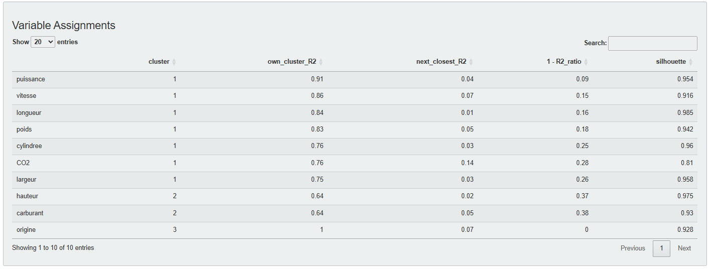

##### Centroids Correlations

Correlation matrix between cluster centroids (lower correlations = better separation).

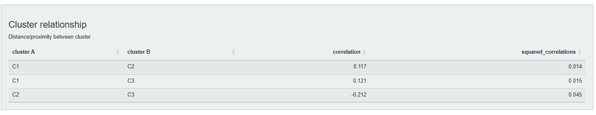

##### R² Matrix

Complete matrix of R² values between all variables and all cluster centroids.

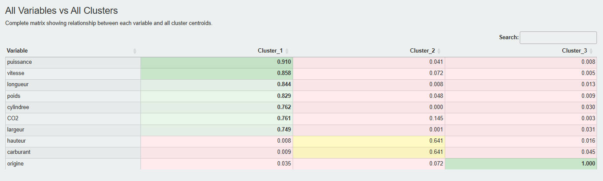

---

#### Visualization Tabs

##### Elbow Method

Plot of aggregation levels (HClustVar) or inertia (K-means) to help determine optimal K.

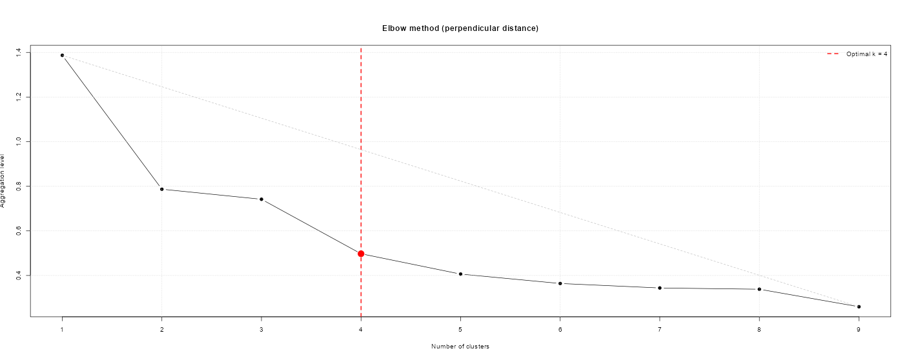

##### Factorial Projection

Variables projected in reduced dimensional space (MDS for HClustVar, PCA for K-means).

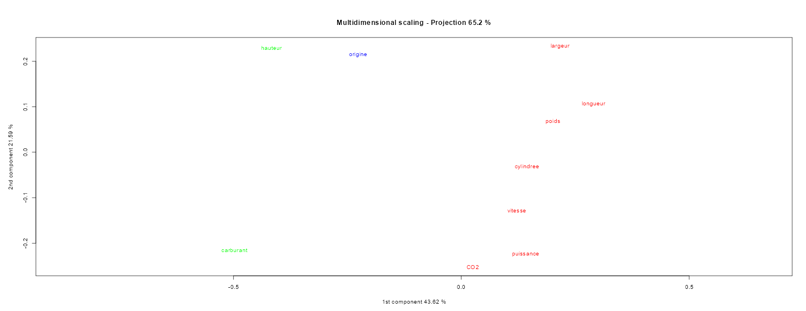

##### Dendrogram (HClustVar only)

Hierarchical tree structure with cluster coloring.

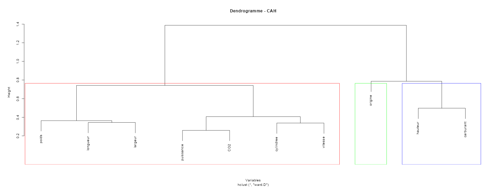

##### Silhouette Plot (HClustVar only)

Silhouette coefficients for each variable showing cluster fit quality.

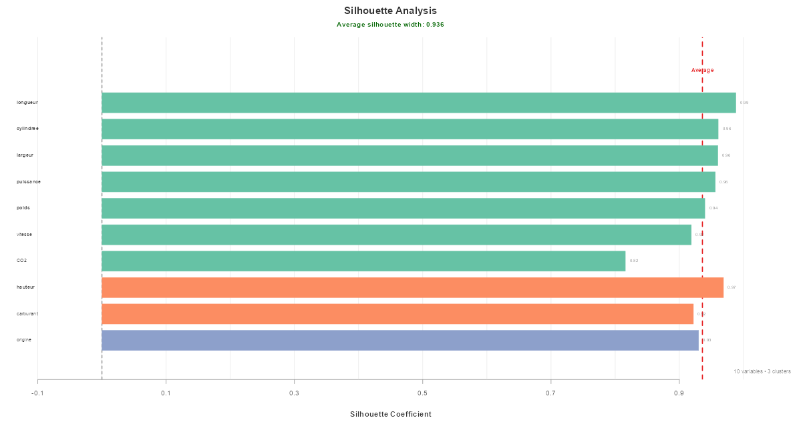

---

#### Predict Tab

If illustrative variables were configured, this tab shows their predicted cluster assignments.

##### Predicted Clusters

Table with cluster assignment for each illustrative variable.

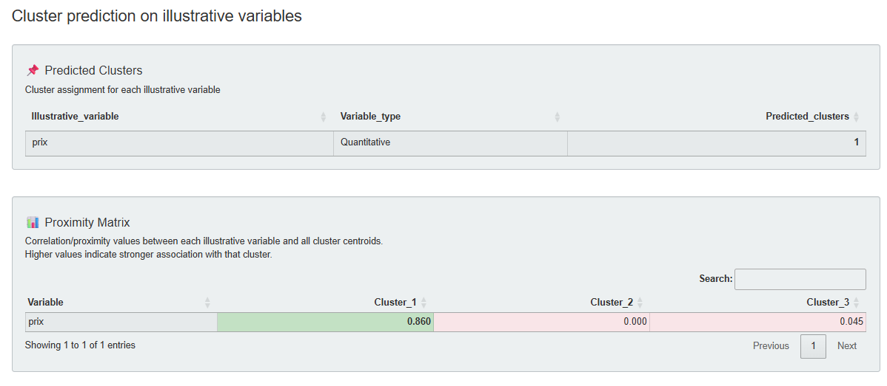

---

## Available Algorithms

### HClustVar (Hierarchical Variable Clustering)

**Best for**: Exploratory analysis, mixed data types, when you want to see the hierarchical structure.

**Features**:
- Supports quantitative, qualitative, and mixed variables
- Multiple linkage methods (Ward, Complete, Average, etc.)
- Dendrogram visualization
- Cut tree at any level

**Parameters**:
```
Variable type: auto / quant / qual / mixed
Distance metric: R² / r (for quantitative)
Clustering method: ward.D / ward.D2 / complete / average / single
Number of clusters
```

### KmeansVariables (K-means Variable Clustering)

**Best for**: Larger quantitative datasets, when K is known or can be estimated.

**Features**:
- Fast computation with multiple initializations
- PCA-based centroids
- K selection (via elbow plot)
- Reproducible results with random seed

**Parameters**:
```
Distance metric: R² / r
Max iterations: 100 (default)
n_init: 10 (default)
Random seed: 0 = random
Number of clusters
```

### ModCluster (Modality Clustering)

**Best for**: Categorical data analysis, understanding patterns in category co-occurrences. 
Complete HClustVar algorithm on qualitatives.

**Features**:
- Clusters modalities (categories) rather than variables
- Uses Dice distance for dissimilarity
- Hierarchical clustering with dendrogram
- MCA-based visualization of modalities

**Parameters**:
```
Variable type: Qualitative (fixed)
Linkage method: Complete / Average / Single
Number of clusters
```

---

## Output Tabs

| Tab | HClustVar | K-means | ModCluster | Description |
|-----|-----------|---------|----------|-------------|
| 📊 Data Preview | ✅ | ✅ | ✅ | View imported data |
| 🔍 Variable Configuration | ✅ | ✅ | ✅ | Configure variable roles |
| 📋 Summary | ✅ | ✅ | ✅ | Quality metrics and cluster details |
| 📈 Elbow Method | ✅ | ✅ | ✅ | Optimal K determination |
| 🗺️ Factorial Projection | ✅ | ✅ | ✅ | Variable/modality visualization |
| ➡️ Predict | ✅ | ✅ | ✅ | Illustrative predictions |
| 🌳 Dendrogram | ✅ | ❌ | ✅ | Hierarchical tree |
| 📊 Silhouette Plot | ✅ | ❌ | ✅ | Cluster quality per element |
| 🔄 Contribution | ❌ | ✅ | ❌ | Top contributing variables |

---

## Troubleshooting

### Common Issues

#### "No file selected"

**Solution**: Click "Browse" and select a CSV or Excel file.

#### "Error: requires numeric data"

**Cause**: K-means only supports quantitative variables.

**Solution**:
- Use HClustVar for qualitative/mixed data
- Or configure only numeric variables as "Active"

#### Empty visualizations

**Cause**: Clustering not yet executed.

**Solution**: Click "🚀 Run Clustering" button.

#### Poor silhouette scores

**Solutions**:
- Try different number of clusters
- Change clustering method (Ward usually works best)
- Check for problematic variables in Variable Configuration

#### Illustrative variables not predicted

**Cause**: No illustrative variables configured.

**Solution**: Open Variable Configuration and set some variables as "Illustrative".

---

## Best Practices

### 1. Data Preparation

- Remove ID columns (set as Excluded)
- Handle missing values before import
- Ensure correct variable types in your file

### 2. Variable Configuration

- Start with all variables as Active
- Move irrelevant variables to Excluded
- Use Illustrative for variables you want to predict

### 3. Parameter Selection

- Start with **Ward D2** method (usually best)
- Use **R²** distance metric for most cases
- Check **Elbow Method** tab to choose K

### 4. Result Interpretation

- Check **Average Silhouette** (> 0.5 is good)
- Examine **Factorial Projection** for cluster separation
- Review **Variable Assignments** for cluster composition

---

## Example Workflow

```r
# 1. Launch the application
library(VarClustering)
varclust_gui()

# 2. In the Shiny interface:
#    - Import your data file (CSV/Excel)
#    - Configure variables (Active/Illustrative/Excluded)
#    - Select algorithm (HClustVar or K-means)
#    - Set parameters (method, distance, K)
#    - Click "Run Clustering"
#    - Analyze results in the tabs
```

---

*VarClustering Package - Eugénie Barlet, Modou Mboup, Axel Cano*
